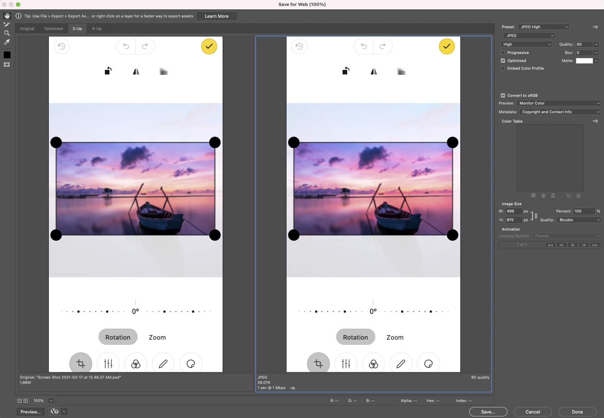

### Start with high resolution images
You can always size them down, but you can’t size them up. They will pixelate and compromise the image quality. 
### Deciding on a format
If the photo does not have transparency, use JPG format. Most photos should be saved as JPGs
If the photo has transparency use PNG format. Illustrations, logos, icons or other non-rectangular photos will often require transparency.
### Determining the dimensions needed
Properly sized images will make sure the images look good, and load quickly on the page. Your website may require specific sizes for particular uses, but you can use the chart below as a general guideline.

| Screen Width | Image Width| Goal Size
| --- | --- | --- |
| Full Screen | 2200px | < 1M
| Content Width | 1400px | < 500K
| 1/2 Column | 700px | < 150K
| 1/4 Column | 350px | < 50K
## Compressing a JPG
If JPG is the right format for this image, then make sure you use compression to further optimize the file size. There are tools that can automate this, but the best way to find the right level of compression is to use your eyes. Photoshop makes is easy to see a side-by-side comparison between the original and compressed version of the file. Use as much compress as possible without compromising the image quality. The compression amount will be different depending on the contents of the photo.
### Using “Save for web” in Photoshop
1. Hold `cmd-opt-shift-S` to open the Save for Web window
2. Click “Preview” to see the current and optimized version side-by-side

3. If no transparency is required, use jpg and compress as much as possible before the image quality degrades.
4. If it needs transparency, use png (no other compression options are available)
5. Click `Save`

## Naming the file
Once you’ve created the perfect image, you’ll need to name it. This is important for 2 reasons.
1. For finding the file when you need it
2. For search engines to better understand the contents
When naming the file use a naming convention that is consistent and descriptive.
`IMG—000345.jpg` will be impossible to find to add to your blog post, and says nothing about the image. `girl-holding-icecream.jpg` will be easier to find and identify.
## Storing the file
Keep your files organized so you can find them again in the future. Also, when you save your optimized images, be sure not to save over your original. You’ll want to always have the highest resolution version to refer back to in the future.