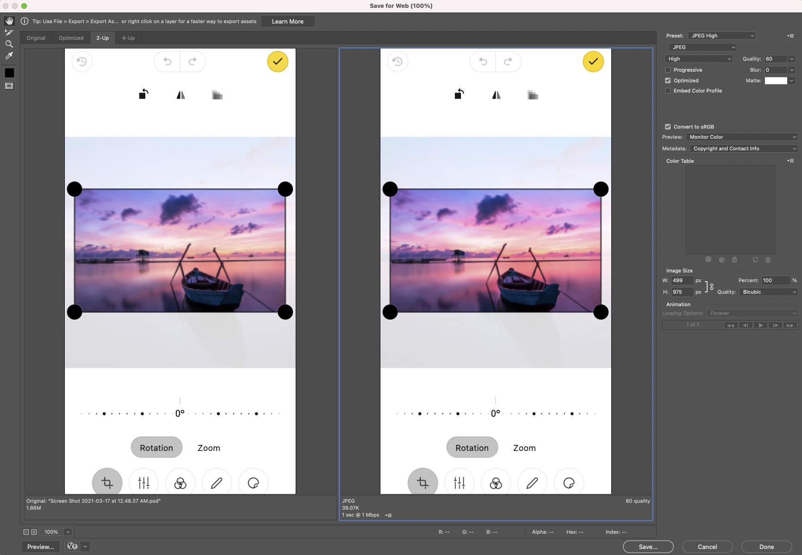

### Step One: Gathering Assets

* Make sure that what is needing to be viewed is connected to a flow:
* Check that all photos and backgrounds are exported for download. And make sure that all icons, colors, components, and type styles are named. 
* Have all assets that the developer may need ready for export such as: images, icons, logos, and components. The exporting toggle is in the side of the layers panel.
* Create a link for development in the ‘Share’ panel:
* Check the assets will be “exported for web” and the box is checked for downloadable assets.

### Step Two: Check assets and Naming

Resolve all comments in the “Comment” tab in the viewing view of the flow.
Go to the development link and check the panel and ensure that all images and icons can be downloaded.

Make sure your assets are matching the style names that were given and are linked to their styles.

Take a look at the Design Token section and ensure that character/color styles are in css format

### Step 3: Comment needs non visual ideas

* Any interactions or ‘easter eggs’ that is needed for the design should be in the website but is not visual to the design. 
* Pin links/ buttons and comment URL links .

### Step 4: Optimize images (pngs & jpegs)

1. Open in Photoshop
2. Hold `cmd-opt-shift-S` to open the Save for Web window
   * Click “Preview” to see the current and optimized version side-by-side

   * If no transparency is required, use jpg and compress as much as possible before the image quality degrades.
   * If it needs transparency, use png (no other compression options are avialable)
2. Resize to match required size as noted in XD


Images should be no wider than 2200px (a full-width background image), and no larger than 300kb if possible. Try to make the images as small as possible without compromising the image quality.

