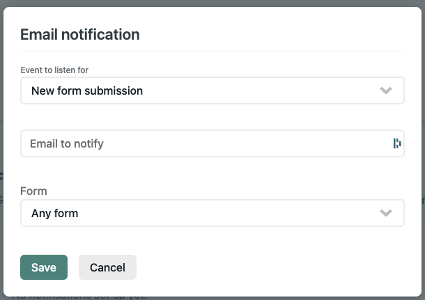

## Setup

1. Create new Hugo Site

The naming convention for the folder and repo will be {project name}-coming-soon

```bash
hugo new site [folder name]
```

2. Initilize git in the folder

```bash
git init
```

3. Add the submodule into the themes folder

```bash
git submodule add https://github.com/gtma-agency/coming-soon-theme.git themes/coming-soon
```

4. Copy the contents of the folder `example-site` into the `content` folder on the site

5. Copy the contents of `__config.toml` from the theme root into the `config.tom.` in the site root


baseURL = "http://example.org/" # replace with production url when we go live
languageCode = "en-us"
title = "Coming Soon"
#theme = "coming-soon" # uncomment this line after copying to config.toml

[seo]
  GTMID = ""
  metaTitle = ""
  metaDescription = ""

[params]
  # 1 - Full-width Image, 2 - Two Column, 3 - Two image
  themeOption = 1
  enableForm = 1
  enableMap = 1
  [params.map]
    APIKey = ""
    coordsLat = 45.819790
    coordsLong = -122.700560
    zoom = 14
  [params.style]
    primary = "#B79F39"
    secondary = "#facade"
    bodyBg = "#2b2e34"
    bodyColor = "#ffffff"
    bgCustom = "#294954"
    fontEmbed = '<link href="https://fonts.googleapis.com/css2?family=Roboto+Condensed:ital,wght@0,300;0,400;0,700;1,300;1,400;1,700&display=swap" rel="stylesheet">'
    fontFamily = "'Roboto Condensed', sans-serif"



Line 4 is commented out in the example site, this will need to be uncommented for the site.


## Customize
### Adding brand colors

Colors are added to the `config.toml` in `params.style`

### Adding Fonts

Add the embed link to the `fontEmbed` line in `config.toml`

### Adding Logo

Logo files are places in the `/static` folder root

### Adding Images

Image files are placed in the `/static` folder root

## Push to Github

1. Create a repo in GTMA-agency on github with the folder name chosen above
2. Push repo to github

## Set up the Form

1. Go to Site Settings and click Forms on the left
2. Scroll down to `Form notifications`, click `Add notification`
3. Select `Email notification`
4. Add the email address provided to send form notifications.

## Set up the map

1. From the address, find the lat and long coordinates using a tool like: [latlong.net](https://www.latlong.net/)
2. Add those to the config.toml
3. Add the Google Maps API key (*.netlify.app has been enabled)



## Deploy to Netlify

1. Log into netlify
2. Click `New Site from Git`
3. Select github
4. Choose the GTMA-agency team
5. Locate the repo
6. It should automatically identify that it's a hugo site
7. Click `Deploy Site`


Modify this temporary domain to match the repo and folder name. Once it's successufully deployed, click the temporary domain link. That will be used for the client to review and approve.


## Live on Production Domain

1. Update the default domain in `config.toml` file
2. In netlify go to `Site Settings`

   * Click "Add Custom Domain" and add the domain provided by the client
   * Click `Check DNS Configuratioin` and copy these instructions to send to the client to set it up, or get login information for us to do it for them.


3. Once the domain has propogated, scroll down to the HTTPS section and click "Verify DNS Configuration" to add an SSL certificate to the site.

## QA and Testing

1. Update the list of domains that are enabled for the Google Maps API key to include the production domain
2. Test the form submission

   * It goes to the right recipient
   * The subject line is appropriate
   * The thank-you page works, and has proper copy
   * Validates properly for required fields, and proper email format

3. Final review on mobile and across browsers
