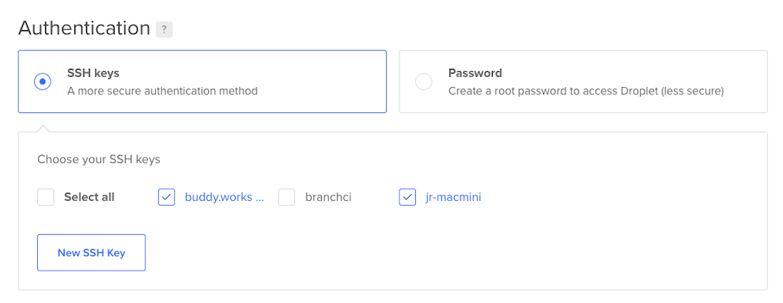

1. Log in to Digital Ocean
2. Click Create and choose Droplet from the upper right corner

### For WordPress Sites

1. Under 'Choose an Image' select the Marketplace tab
2. Select Wordpress
   
3. Under 'Choose a plan' select Basic
   
4. Under CPU options select 'Regular Intel with SSD'
5. Choose the $5/mo option
6. Choose a data center from San Francisco.
7. Under Authentication select SSH keys and give access to `buddy.works`, `jr-macmini` and yours
   
8. Under 'Choose a hostname' follow this naming conventions
   1. project short name (will also be used as the subdomain for gtma.dev) followed by `-dev`
9.  Click 'Create Droplet'

### Add Domain

1. In the Domains section, click `gtma.dev`
2. Add the hostname (prefix from the droplet host name above), and choose the corresponding droplet from the dropdown menu.

### WordPress Installation

Once the droplet has finished being created and the domain has been created click the "Getting Started" link and follow the setup instructions on the server.

