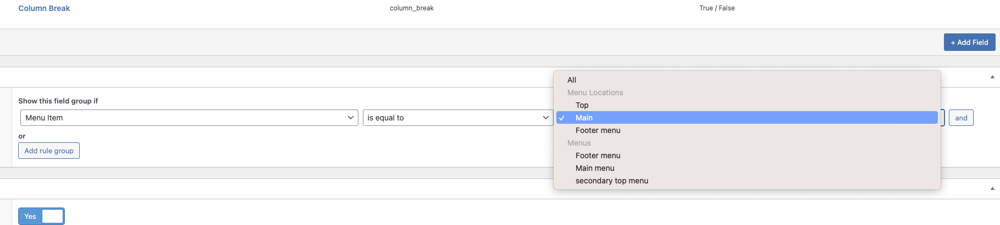

## Setting up the Navigation

Using Advanced custom fields, we can add features to Menus, Menu Items, and specify the menu that we want these fields to apply to. Get creative! Add images and descriptions, custom styling, and custom actions based on the visual or functional needs for this menu.




---
### Here's how it connects to the front end.


---
### Here's as example of what it might look like on the admin side.


## Creating the Template

Typically, if you want to modify the structure of the WordPress menu, you'll need to use the Custom NavWalker class. However, we've found it to be cumbersome, and difficult to use. We recommend using [the Navi class by Log1x](https://github.com/Log1x/navi) to simplify access to each menu item, and access it in a more organized way. 

## Usage

Check out the [**examples**](examples) folder to see how to use Navi in your project.

### Basic Usage

```php
<?php

use Log1x\Navi\Navi;

$navigation = (new Navi())->build('primary_navigation');

if ($navigation->isEmpty()) {
  return;
}

return $navigation->toArray();
```


### Accessing Custom fields within Navi

The example below  shows how to access the custom fields attached to the menu items.

In order to access those fields use the `id` within each menu item's object

```php
get_field('column_break', $child->id)
```

See the completed example below.

```html
<?php use Log1x\Navi\Navi;

$navigation = (new Navi())->build('menu2');

?>

<nav class="navbar navbar-expand-md navbar-light bg-light" role="navigation">
    <div class="container">
        <div class="row">
            <div class="menu">
    <?php if ( $navigation->isNotEmpty() ) : ?>
            <nav id="site-navigation" class="main-navigation navbar">
            <div class="navbar-header">
                <button type="button" class="navbar-toggle collapsed" data-toggle="collapse" data-target="#navbar" aria-expanded="false" aria-controls="navbar">
                <span class="sr-only">Toggle navigation</span>
                <span class="icon-bar"></span>
                <span class="icon-bar"></span>
                <span class="icon-bar"></span>
                </button>
                <div id="logo" class="navbar-brand" href="#">
                    <?php the_custom_logo() ?>
                </div>
            </div>
            <div id="navbar" class="navbar-collapse collapse">
            <div id="nav-top">
                    <?php
                    wp_nav_menu(array(
                        'theme_location' => 'menu1',
                        'menu_class' => '',
                        'menu_id' => 'top-nav-flag',
                        'items_wrap' => '<ul id="secondary_nav">%3$s</ul>',
                    ));
                    ?>
                    <div class="search-block">
                        <?php get_search_form(); ?>
                    </div>
                </div>
            <ul id="primary-menu" class="nav navbar-nav">
                <?php foreach ( $navigation->toArray() as $item ) : ?>
                    <?php // var_dump($item) ?>

                    <li class="<?php echo $item->classes; ?> <?php echo $item->active ? 'current-item' : ''; ?> <?php echo $item->children ? 'dropdown' : ''; ?>">
                        <a class="<?php echo $item->children ? 'dropdown-toggle' : ''; ?>" <?php echo $item->children ? 'data-toggle="dropdown" role="button" aria-haspopup="true" aria-expanded="false"' : ''; ?> href="<?php echo $item->children ? "#" : $item->url ?>">
                            <?php echo $item->label; ?><?php echo $item->children ? '<span class="caret"></span>' : ''; ?>
                        </a>

                        <?php if ( $item->children ) : ?>
                            <div class="dropdown-menu mega-menu nav">
                                <div>
                                <?php foreach ( $item->children as $child ) : ?>
                                    <?php $col_break = get_field('column_break', $child->id) ?>
                                    <?php $section_label = get_field('section_label', $child->id) ? "section-label" : '' ?>
                                    <?php if ($col_break) { echo "</div><div>"; } ?>
                                    <div class="<?php echo $child->classes; ?> <?php echo $child->active ? 'current-item' : ''; ?>">
                                        <?php if ($section_label) : ?>
                                            <div class="section-label"><?php echo $child->label; ?></div>
                                        <?php else : ?>
                                            <a class="section-label" href="<?php echo $child->children ? "#" : $child->url ?>">
                                                <?= $child->label ?>
                                            </a>
                                        <?php endif ?>
                                        <?php if ( $child->children ) : ?>
                                            <ul class="nav">
                                                <?php foreach ( $child->children as $grandchild ) : ?>
                                                    <li class="<?php echo $grandchild->classes; ?> <?php echo $grandchild->active ? 'current-item' : ''; ?>">
                                                        <a href="<?php echo $grandchild->url; ?>">
                                                            <?php echo $grandchild->label; ?>
                                                        </a>
                                                    </li>
                                                <?php endforeach; ?>
                                            </ul>
                                        <?php endif; ?>
                                    </div>
                                <?php endforeach; ?>
                                </div>
                            </div>
                        <?php endif; ?>
                    </li>
                <?php endforeach; ?>
            </ul>
            </div>

        </nav>
    <?php endif; ?>
</div>
        </div>
    </div>
</nav>

```
