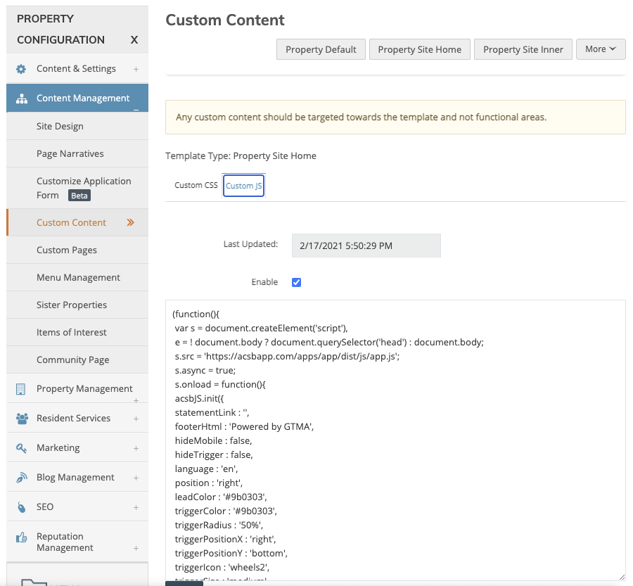
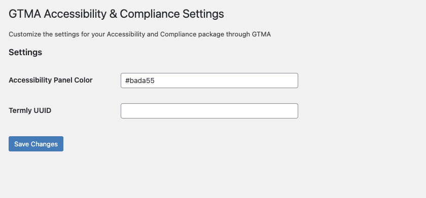

1. Identify the URL of the site being set up.
1. Log in to [the AccessiBe accounts page](https://accounts.accessibe.com/)
2. Click `Add Websites`
3. Copy and paste the url from the browser to the box provided
   1. Choose "Start the Free Trial"
   2. Click "Manage"
4. Enter (Info provided by the AM or from a survey)
   1. Website Owner’s Name

        _If multi-family, this should be the name of the LLC that owns the building._

   2. Website Owner’s Email
   3. Website Owner’s Phone
5. Enter Payment
   1. Choose Monthly Billing ($33)
6. Click "Go To Billing"

```javascript
(function(){
    var s = document.createElement('script'),
    e = ! document.body ? document.querySelector('head') : document.body;
    s.src = 'https://acsbapp.com/apps/app/dist/js/app.js';
    s.async = true;
    s.onload = function(){
    acsbJS.init({
        statementLink : '',
        footerHtml : 'Powered by GTMA',
        hideMobile : false,
        hideTrigger : false,
        language : 'en',
        position : 'right',
        leadColor : '#9b0303', // customize to the site colors
        triggerColor : '#9b0303', // customize to the site colors
        triggerRadius : '50%',
        triggerPositionX : 'right',
        triggerPositionY : 'bottom',
        triggerIcon : 'wheels2',
        triggerSize : 'medium',
        triggerOffsetX : 20,
        triggerOffsetY : 20,
        mobile : {
            triggerSize : 'small',
            triggerPositionX : 'right',
            triggerPositionY : 'center',
            triggerOffsetX : 10,
            triggerOffsetY : 0,
            triggerRadius : '50%'
        }
    });
    };
    e.appendChild(s);
}());
```
## For RENTCafe

1. Login and go to the property
2. Go to Content Management -> Custom Content
3. Choose the Custom JS tab



4. Paste the code from above into the field

5. Replace the hex code for the `leadColor` and `triggerColor` with the primary brand color on the site. This can be the color of the nav, but also needs to have a strong contrast against the background color or image.


Make sure the "Enabled" checkbox is checked.

<div class="embed-responsive embed-responsive-16by9">
    <iframe class="embed-responsive-item" src="https://drive.google.com/file/d/19FD8FFMNdZqOpT-4Sa4oGQ0GFElUBb_o/preview" width="720" height="480"></iframe>
</div>

## For WordPress

1. Log in to WordPress by going to _clientdomain.com_/__wp-admin__
2. Go to Plugins>Add New
3. Download our plugin here [GTMA A+C Plugin](https://github.com/gtma-agency/gtma-accessibility-compliance/archive/refs/heads/main.zip)



4. Enter the primary brand color as a hex color code.


Depending on the cache settings, this may take a while to show up. If you know how to clear the server cache, do so to speed up the visibility of this change. Also, be sure to check the popup in an incognito window before informing the client that it's live to avoid any confusion.
