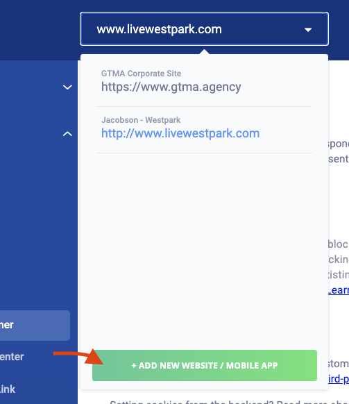
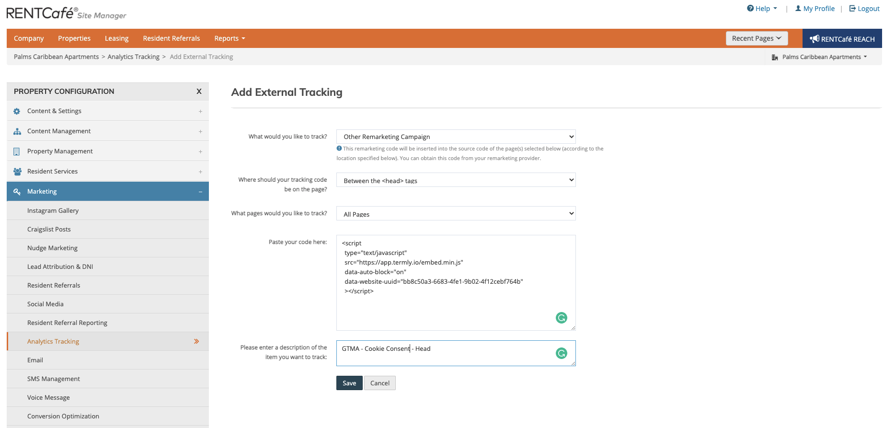

1. Log in to [the Termly accounts page](https://app.termly.io/user/login)
2. Click on the dropdown at the top of the screen and choose + Add New Website
   
3. Click "Purchase"
4. Once Paid click on the dropdown again and click "+ Add New Website" and you'll see a dialog box that allows you to add the name and url of the new site.
5. Enter the Company Info
    * Full Legal Name of the Company or Organization
        If multi-family, use the name of the LLC that owns the building
    * Email
    * Phone Number
    * Address
    * Country
    * State, Territory, or Province
    * ZIP Code / Postal Code
6. Submit the form
7. Click "Scan Now" Your Website (this take about 1 minute)
8. Click "Banner Settings" on the left sidebar
   * Click the "Custom Theme" button
   * Find the hex color code used in the Accessibility Widget and make that the Button Background Color
   * Take the defaults for the rest
   * Click "Save"
 * Click "Embed Consent Banner"
 * "Copy to Clipboard"

## For RENT Cafe

1. Log in to RENT Cafe
2. Got to Marketing -> Analytics Tracking
3. Click "Add New Item"
4. Fill out the form
   1.  "What would you like to track?" - `Other Remarketing Campaigns`
   2.  "Where should your trakcing code be on the page?" - `Between the <head> tags`
   3.  "What page would you like to track?" - `All Pages`
   4.  Paste the code here: - 'Paste code copied from Termly'
   5.  Description  - "GTMA - Cookie Consent - Head"

   6.  Wait a few minutes (like 10)
   7.  Confirm that the pop up displays on the site
   8.  Return to the Termly interface and click the "Verify Installation"
