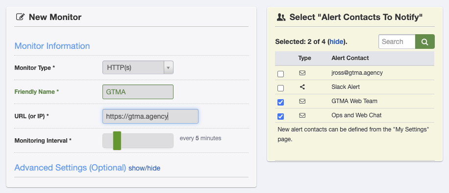

## Add a new maintenance Client
1. Sign in to [ManageWP](https://orion.managewp.com/login)
2. Click the plus sign in the upper left corner and choose `Add Website`
3. Enter the URL of the site to be added
4. Enter the Administrator Credentials
5. Click `Add Website`

## Add Security Scan
1. Click on Security and choose the `Schedule` tab
2. Click `Buy add-on`
3. Schedule Security checks to run weekly on Sundays

## Add Performance Scan
1. Click on Performance and choose the `Schedule` tab
2. Click `Buy add-on`
3. Set Alerts if PageSpeed and YSlow are `C or lower`
4. Schedule Performance checks to run weekly on Monday.
5. Alert if page load time is longer than 10s.
6. For Scan Region, choose the region closest to the client's location.

## Add Client Report
1. Click on Client Report and choose the `Schedule` tab
2. Click `Buy add-on`
3. Click `Add Client`
   * Info provided by the AM in the survey
4. Schedule Report to run on the first day of the month.
   * Choose template "GTMA Default" unless it's a special case
   * For Sending Options leave the default
   * Click `Save Changes`

## Add Uptime Monitoring
1. Sign in to [Uptime Robot](https://uptimerobot.com/)
2. Click `+ Add New Monitor` in the upper left corner
3. For `Monitor type` select `HTTP(s)`
4. For `Friendly name` add the Company Name
5. for `URL` add the URL
6. Leave the Monitoring Level at 5 minutes
7. On the right under _Alert Contacts to notify_, select 'GTMA Web Team' and 'Ops and Web Chat'

